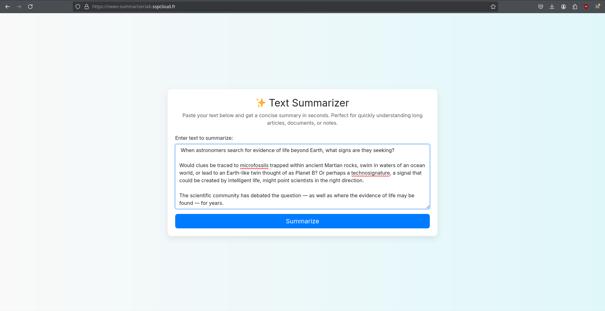

# Modèle Transformer pour résumer des articles d'information :newspaper:

Ce projet explore le modèle de Transformer, inspiré par l'article [*Attention Is All You Need*](https://arxiv.org/abs/1706.03762). Nous avons entraîné un modèle Transformer pour **résumer des articles d'information** avec les données suivantes : [Kaggle News Summarization dataset](https://www.kaggle.com/datasets/sbhatti/news-summarization).


---

# Utiliser ce projet

Le projet est deployé sur le SSPCloud à l'adresse suivante : [news-summarizer.lab.sspcloud.fr](https://news-summarizer.lab.sspcloud.fr/). Le dépôt GitOps contrôlant le déploiement sur ArgoCD est disponible à l'adresse suivante : [github.com/boalong/transformer-news-summarization-deployment](https://github.com/boalong/transformer-news-summarization-deployment).

L'interface suivante apparaît : il ne reste qu'à entrer l'article de votre choix et attendre le résumé.

.

Pour utiliser ce projet sur votre propre installation (recommandé si vous souhaitez un temps de réponse plus rapide), il est aussi possible d'utiliser le Dockerfile, ainsi que la dernière image Docker du projet accessible au lien suivant : [hub.docker.com/r/nico5655/ensae-prod](https://hub.docker.com/r/nico5655/ensae-prod).

---


# 📁 Structure du projet

- `src/` : Contient l'ensemble des scripts Python nécessaires à l'entraînement, au pré-traitement et à l'évaluation de notre modèle.
- `train_test.py` *(à la racine)* : Permet d'entraîner le modèle.
- `app/api.py` : Lance une API pour interagir avec le modèle entraîné.

---


# 📦 Données et poids du modèle

- **Données** : Hébergées publiquement sur un serveur **S3** (données brutes et données nettoyées).
- **Poids du modèle** : Disponibles sur **HuggingFace** et automatiquement récupérés lors du lancement de l’API.

---


# 🚀 Installation

1. **Cloner le dépôt :**

```bash
git clone https://github.com/nico5655/transformer-news-summarization.git
cd transformer-news-summarization
```
## Créer un environnement virtuel
```bash
python -m venv env
```
## Activer l’environnement virtuel
```bash
source env/bin/activate 
```
## Installer les dépendances
```bash
pip install -r requirements.txt
python -m spacy download en_core_web_sm
```

## Nettoyage et pré-traitement des données (optionnel : données sur le S3)

```bash
python src/features/create_data.py
```

## Entraînement du modèle Transformer (optionnel : poids entraînés disponible sur Huggingface)

```bash
python train_test.py
```

## API : prend directement les poids du modèle qui sont sauvegarder sur Huggingface et permet d'avoir une interface pour communiquer

```bash
uvicorn app.api:app --reload
```

### Performance : 

Le modèle a été entraîné sur un GPU NVIDIA A100 avec 40 Go de mémoire. 
ROUGE (Recall-Oriented Understudy for Gisting Evaluation) est une méthode d'évaluation utilisée principalement pour évaluer la qualité des résumés automatiques ou de la traduction automatique. Elle compare les n-grammes (séquences de mots) entre le texte généré par le modèle et un ou plusieurs résumés de référence.

| Model                        | ROUGE-1 | ROUGE-2 | ROUGE-L | Train Time (ep)  | Params  |
|------------------------------|---------|---------|---------|------------------|---------|
| Transformer                  | 0.20    | 0.04    | 0.15    | ~ $1.6 \times 10^4$ s (25) | $1.25 \times 10^7$  |
